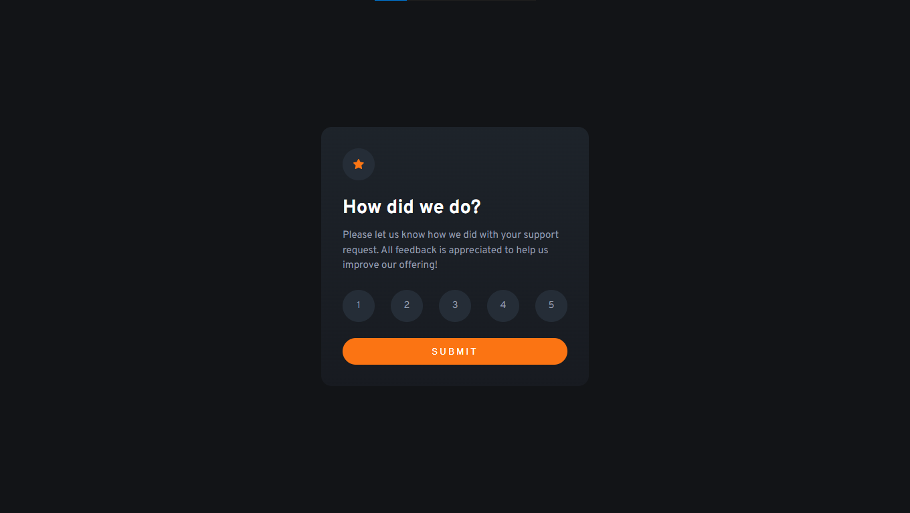
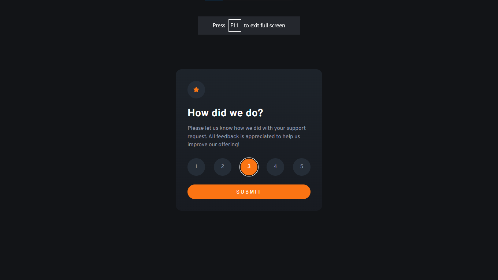
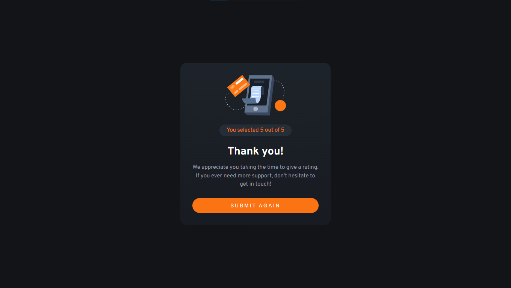
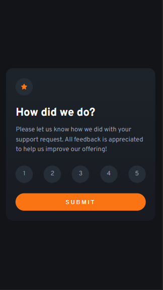
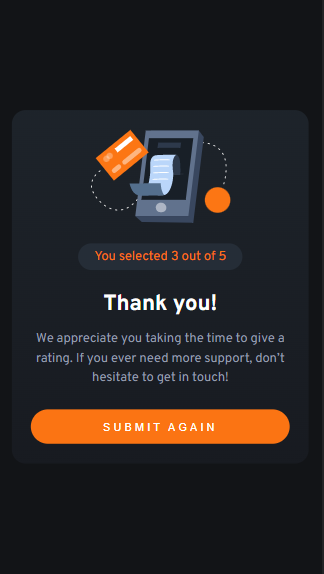

# Frontend Mentor - Interactive rating component solution

This is a solution to the [Interactive rating component challenge on Frontend Mentor](https://www.frontendmentor.io/challenges/interactive-rating-component-koxpeBUmI). Frontend Mentor challenges help you improve your coding skills by building realistic projects.

## Table of contents

- [Overview](#overview)
  - [The challenge](#the-challenge)
  - [Screenshot](#screenshot)
  - [Links](#links)
- [My process](#my-process)
  - [Built with](#built-with)
  - [Useful resources](#useful-resources)
- [Author](#author)

## Overview

### The challenge

Users should be able to:

- View the optimal layout for the app depending on their device's screen size
- See hover states for all interactive elements on the page
- Select and submit a number rating
- See the "Thank you" card state after submitting a rating

### Screenshot

- Desktop Design



- Desktop active state



- Desktop thank you state



- Mobile Design



- Mobile thank you state



### Links

- Solution URL: [Add solution URL here](https://your-solution-url.com)
- Live Site URL: [Add live site URL here](https://your-live-site-url.com)

## My process

### Built with

- Semantic HTML5 markup
- CSS custom properties
- Flexbox
- Desktop-first workflow

### What I learned

#### DOM Manipulation

```js
for (var i = 0; i < 5; i++) {
  document.querySelectorAll(".btn")[i].addEventListener("click", function () {
    document.getElementById("rating").innerHTML = Number(this.innerHTML);
  });
}

submit.addEventListener("click", function () {
  submitContainer.classList.add("hidden");
  thank_you_Container.classList.remove("hidden");
});
```

### Useful resources

- [Mozilla Web Docs](https://developer.mozilla.org/en-US/docs/Web/API/Document_Object_Model) - This helped me for DOM Manipulation. I really liked this pattern and will use it going forward.

## Author

- Website - Ankit Waware
- Frontend Mentor - [@ankitwaware](https://www.frontendmentor.io/profile/ankitwaware)
